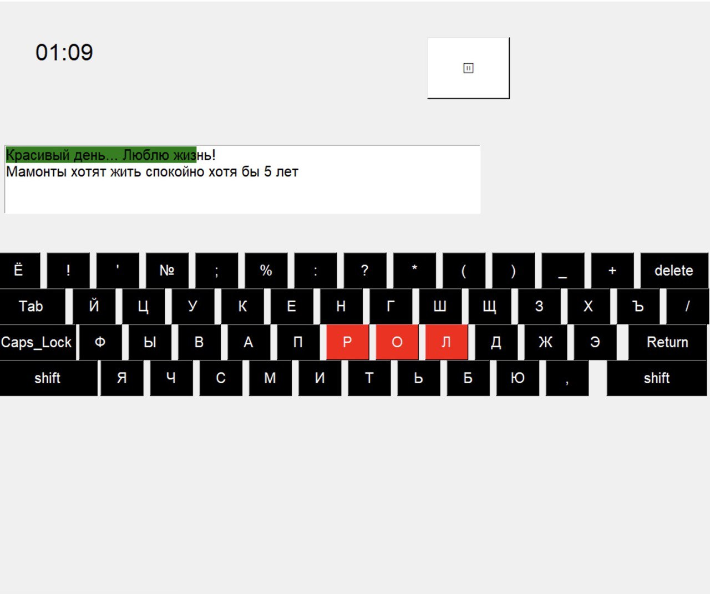

Данная программа представляет собой клавиатурный тренажер.

Тренажер содержит встроенную базу текстов, хранит статистику пользователей.

Пользователь вводит имя и начинается игра. На экран выводится время игры.
Есть возможность поставить игру на паузу

Во время игры вводимый текст подсвечивается зеленым на экране.
Также верно и неверно нажатые клавиши демонстрируются на экранной клавиатуре.
Реализована смена раскладки при нажатии на Shift.

После окончания игры пользователь получает уведомление о своем результате,
который сохраняется для хранения статистики

По кнопке Статистика пользователь может ознакомиться с общей статистикой по игрокам.

Также при нажатии на свое имя, пользователь увидит все его сыгранные игры и статистику по ним.

